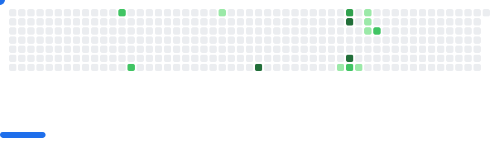

## Hello I'm Ashwin 👋


```json
{
  "job": "Software Engineer",
  "workplace":"Citytech",
  "country": "Nepal",
  "city": "Kathmandu"
}
```


## Main Stacks
<div style="display:flex;flex-direction:row;gap:12px;align-items:center;flex-wrap:wrap">
<!-- java -->
<svg xmlns="http://www.w3.org/2000/svg"  fill="none" viewBox="0 0 20"><path fill="#5382A1" d="M36.753 77.336s-3.822 2.222 2.72 2.974c7.924.904 11.973.774 20.706-.879 0 0 2.296 1.44 5.502 2.687-19.576 8.39-44.304-.486-28.928-4.782M34.36 66.387s-4.286 3.173 2.26 3.85c8.464.873 15.149.945 26.716-1.283 0 0 1.6 1.622 4.116 2.51-23.668 6.92-50.03.545-33.092-5.077"/><path fill="#E76F00" d="M54.527 47.815c4.823 5.554-1.268 10.551-1.268 10.551s12.248-6.322 6.623-14.24C54.63 36.743 50.6 33.074 72.41 20.425c0 0-34.234 8.55-17.883 27.39"/><path fill="#5382A1" d="M80.418 85.434s2.827 2.33-3.115 4.133c-11.3 3.423-47.03 4.456-56.956.136-3.568-1.552 3.124-3.706 5.228-4.159 2.195-.475 3.45-.387 3.45-.387-3.968-2.795-25.648 5.49-11.012 7.861 39.913 6.473 72.757-2.914 62.405-7.584M38.59 55.044s-18.174 4.317-6.436 5.884c4.956.664 14.837.514 24.04-.258 7.522-.634 15.075-1.983 15.075-1.983s-2.653 1.136-4.571 2.446c-18.457 4.854-54.11 2.596-43.846-2.37 8.68-4.195 15.738-3.72 15.738-3.72m32.603 18.224c18.762-9.75 10.088-19.118 4.033-17.856-1.484.309-2.146.576-2.146.576s.551-.863 1.603-1.236c11.978-4.212 21.19 12.42-3.867 19.007 0 0 .29-.26.377-.491"/><path fill="#E76F00" d="M59.882 0s10.39 10.395-9.855 26.377C33.793 39.2 46.325 46.51 50.021 54.861c-9.477-8.55-16.432-16.077-11.766-23.082C45.103 21.496 64.075 16.51 59.882 0"/><path fill="#5382A1" d="M40.434 99.686c18.009 1.153 45.663-.64 46.318-9.161 0 0-1.259 3.23-14.883 5.796-15.371 2.892-34.329 2.555-45.573.7 0 0 2.302 1.906 14.138 2.665"/></svg>

<!-- postgres -->
<svg xmlns="http://www.w3.org/2000/svg" fill="none" viewBox="0 0 20"><path fill="#000" d="M98.472 59.902c-.582-1.766-2.105-2.995-4.074-3.29-.929-.14-1.992-.08-3.251.18-2.194.454-3.821.627-5.009.66 4.483-7.59 8.129-16.246 10.227-24.393 3.394-13.175 1.58-19.177-.539-21.892C90.218 3.981 82.036.121 72.166.003c-5.267-.065-9.89.978-12.3 1.728-2.246-.398-4.66-.62-7.193-.66-4.749-.076-8.944.962-12.529 3.095a57 57 0 0 0-8.848-2.227C22.644.514 15.672 1.624 10.57 5.237c-6.175 4.375-9.038 11.975-8.509 22.59.168 3.37 2.048 13.625 5.009 23.35 1.701 5.59 3.515 10.232 5.392 13.798 2.661 5.058 5.51 8.035 8.706 9.105 1.792.599 5.048 1.018 8.472-1.842.434.527 1.013 1.05 1.782 1.537.976.618 2.17 1.122 3.361 1.42 4.296 1.078 8.319.808 11.752-.701.02.612.037 1.197.05 1.702.023.82.046 1.623.076 2.374.203 5.08.548 9.029 1.57 11.792.055.152.13.384.21.63.51 1.564 1.361 4.182 3.529 6.232C54.215 99.35 56.929 100 59.415 100c1.247 0 2.437-.164 3.48-.388 3.72-.8 7.944-2.017 11-6.38 2.889-4.125 4.293-10.337 4.547-20.126l.093-.793.06-.517.68.06.176.012c3.788.173 8.42-.633 11.265-1.958 2.248-1.046 9.452-4.86 7.756-10.008"/><path fill="#336791" d="M91.994 60.903c-11.264 2.33-12.038-1.494-12.038-1.494C91.848 41.713 96.82 19.251 92.53 13.753 80.825-1.243 60.564 5.85 60.226 6.033l-.109.02c-2.225-.463-4.716-.74-7.515-.785-5.096-.084-8.963 1.34-11.896 3.57 0 0-36.145-14.93-34.463 18.78.357 7.17 10.25 54.262 22.05 40.039 4.313-5.202 8.48-9.6 8.48-9.6 2.07 1.38 4.547 2.082 7.145 1.83l.202-.172c-.063.646-.034 1.277.08 2.025-3.04 3.406-2.146 4.004-8.223 5.258-6.149 1.271-2.537 3.533-.178 4.125 2.859.717 9.474 1.732 13.943-4.542l-.178.716c1.19.957 2.027 6.222 1.887 10.996-.14 4.773-.234 8.05.704 10.61.94 2.56 1.874 8.32 9.863 6.604 6.674-1.435 10.134-5.152 10.615-11.353.341-4.407 1.114-3.756 1.163-7.697l.62-1.865c.715-5.976.113-7.904 4.225-7.007l1 .088c3.027.138 6.988-.488 9.313-1.572 5.007-2.33 7.976-6.22 3.04-5.198"/><path fill="#fff" d="M42.821 30.825c-1.015-.142-1.934-.011-2.4.342a.88.88 0 0 0-.364.587c-.058.42.235.884.416 1.123.51.678 1.254 1.143 1.991 1.246q.16.022.319.022c1.229 0 2.347-.96 2.445-1.668.123-.887-1.161-1.479-2.407-1.652m33.627.028c-.097-.696-1.33-.894-2.502-.73-1.17.162-2.303.692-2.209 1.389.076.542 1.052 1.467 2.207 1.467q.147 0 .296-.02c.77-.108 1.337-.599 1.606-.882.409-.431.646-.912.602-1.224"/><path fill="#fff" d="M95.743 60.639c-.43-1.303-1.812-1.721-4.11-1.246-6.818 1.411-9.26.434-10.062-.158 5.3-8.098 9.66-17.886 12.013-27.018 1.114-4.326 1.73-8.343 1.78-11.618.056-3.594-.555-6.235-1.814-7.848-5.076-6.505-12.526-9.993-21.544-10.09-6.2-.069-11.438 1.522-12.453 1.97a31 31 0 0 0-7.008-.903c-4.654-.076-8.677 1.042-12.008 3.32a53.5 53.5 0 0 0-9.758-2.566c-7.905-1.277-14.187-.31-18.67 2.875-5.35 3.8-7.819 10.593-7.34 20.19.16 3.229 1.995 13.161 4.89 22.673 3.811 12.52 7.954 19.607 12.313 21.065.51.17 1.098.29 1.747.29 1.59 0 3.54-.719 5.568-3.164a201 201 0 0 1 7.674-8.707 12.34 12.34 0 0 0 5.52 1.489l.014.151q-.498.594-.974 1.206c-1.334 1.698-1.611 2.052-5.905 2.938-1.222.253-4.466.923-4.513 3.204-.052 2.491 3.835 3.538 4.277 3.648 1.543.388 3.03.579 4.448.579 3.447 0 6.482-1.136 8.906-3.335-.074 8.882.295 17.634 1.358 20.3.872 2.183 3 7.519 9.72 7.518.987 0 2.073-.115 3.267-.372 7.015-1.508 10.06-4.617 11.24-11.47.63-3.664 1.712-12.411 2.22-17.103 1.075.336 2.458.49 3.953.49 3.118 0 6.715-.665 8.972-1.715 2.534-1.18 7.108-4.077 6.279-6.593M79.037 28.933c-.023 1.385-.213 2.643-.414 3.956-.217 1.411-.442 2.87-.498 4.642-.056 1.725.159 3.517.367 5.251.42 3.502.85 7.107-.817 10.664q-.415-.739-.739-1.522c-.207-.504-.657-1.313-1.28-2.433-2.423-4.358-8.099-14.565-5.193-18.73.865-1.24 3.061-2.514 8.574-1.828M72.355 5.467c8.08.179 14.472 3.21 18.997 9.009 3.47 4.447-.351 24.686-11.416 42.145l-.335-.424-.14-.175c2.859-4.735 2.3-9.42 1.802-13.574-.204-1.704-.397-3.314-.348-4.827.05-1.602.262-2.977.466-4.306.252-1.638.507-3.333.437-5.332.052-.21.074-.457.046-.75-.18-1.917-2.362-7.652-6.808-12.842-2.432-2.839-5.98-6.016-10.822-8.159 2.083-.433 4.931-.836 8.12-.765M27.14 66.622c-2.234 2.694-3.777 2.177-4.285 2.008-3.306-1.106-7.143-8.114-10.526-19.227-2.927-9.615-4.637-19.285-4.773-21.996-.427-8.575 1.646-14.551 6.162-17.763 7.349-5.226 19.432-2.098 24.287-.511-.07.069-.142.133-.211.203-7.968 8.069-7.779 21.854-7.759 22.697 0 .325.026.785.064 1.418.137 2.319.392 6.634-.29 11.521-.633 4.541.763 8.986 3.83 12.195q.472.494.991.937a205 205 0 0 0-7.49 8.518m8.514-11.391c-2.472-2.587-3.594-6.184-3.08-9.872.72-5.162.454-9.658.311-12.073-.02-.338-.038-.635-.048-.868 1.164-1.035 6.558-3.933 10.404-3.05 1.755.404 2.825 1.603 3.27 3.664 2.301 10.674.304 15.122-1.3 18.697-.33.737-.643 1.433-.91 2.153l-.207.557c-.523 1.407-1.01 2.716-1.312 3.959-2.628-.008-5.184-1.134-7.128-3.168m.403 14.394c-.767-.192-1.457-.526-1.862-.803.338-.16.94-.377 1.984-.593 5.051-1.042 5.832-1.778 7.535-3.947a33 33 0 0 1 1.447-1.748c.914-1.026 1.331-.852 2.089-.537.614.254 1.212 1.026 1.454 1.875.115.401.244 1.163-.178 1.755-3.558 4.997-8.744 4.933-12.469 3.998m26.437 24.668c-6.18 1.328-8.368-1.834-9.81-5.448-.93-2.334-1.388-12.856-1.063-24.477a1.4 1.4 0 0 0-.06-.444 6 6 0 0 0-.173-.821c-.483-1.691-1.659-3.106-3.07-3.692-.56-.233-1.589-.66-2.825-.343.264-1.09.72-2.32 1.216-3.651l.208-.56c.234-.632.528-1.287.839-1.98 1.679-3.74 3.978-8.863 1.483-20.436-.935-4.335-4.057-6.452-8.789-5.96-2.837.294-5.432 1.442-6.727 2.1q-.416.212-.77.41c.36-4.367 1.726-12.53 6.832-17.694C43 8.046 47.282 6.44 52.5 6.527c10.28.168 16.871 5.458 20.591 9.866 3.206 3.799 4.942 7.625 5.635 9.69-5.21-.532-8.753.499-10.55 3.074-3.907 5.601 2.138 16.473 5.044 21.698.532.957.992 1.785 1.137 2.136.946 2.3 2.171 3.835 3.065 4.955.274.343.54.677.743.967-1.578.457-4.413 1.51-4.154 6.779-.209 2.643-1.69 15.02-2.442 19.392-.994 5.776-3.114 7.928-9.074 9.21m25.794-29.6c-1.613.751-4.313 1.315-6.878 1.436-2.833.133-4.275-.319-4.615-.596-.159-3.283 1.06-3.626 2.35-3.99.202-.056.4-.112.59-.179q.178.146.391.287c2.277 1.507 6.339 1.67 12.073.483l.063-.013c-.774.726-2.097 1.699-3.974 2.572"/></svg>

<!-- spring -->
<svg xmlns="http://www.w3.org/2000/svg" fill="none" viewBox="0 0 20"><path fill="#6CB52D" d="M91.059 5.746c-1.437 3.493-3.295 6.59-5.35 9.363C76.641 5.87 63.958 0 49.963 0 22.468-.001 0 22.343 0 49.938 0 64.355 6.168 77.335 15.953 86.5l1.858 1.66A49.68 49.68 0 0 0 49.939 99.9c26.257 0 47.882-20.486 49.74-46.347 1.486-12.559-2.328-28.635-8.62-47.808M23.186 86.92c-1.437 1.858-4.112 2.056-5.97.62-1.858-1.437-2.056-4.113-.62-5.97 1.437-1.858 4.113-2.056 5.97-.62 1.76 1.437 2.057 4.112.62 5.97m67.576-14.937C78.5 88.358 52.143 82.81 35.349 83.626c0 0-2.998.199-5.97.62 0 0 1.14-.52 2.576-1.04 11.84-4.113 17.414-4.955 24.622-8.646 13.5-6.91 26.976-22.046 29.676-37.701-5.152 15.036-20.808 28.016-35.026 33.267-9.785 3.617-27.397 7.11-27.397 7.11l-.718-.422c-11.94-5.87-12.361-31.83 9.487-40.178 9.586-3.716 18.653-1.66 29.057-4.112 11.023-2.577 23.805-10.825 28.932-21.626 5.722 17.415 12.733 44.39.174 61.086"/><path fill="#6CB52D" d="M23.186 86.921c-1.437 1.858-4.112 2.056-5.97.62-1.858-1.437-2.056-4.113-.62-5.97 1.437-1.858 4.113-2.056 5.97-.62 1.76 1.437 2.057 4.112.62 5.97"/></svg>
<!-- angular -->
<svg xmlns="http://www.w3.org/2000/svg" fill="none" viewBox="0 0 20"><path fill="#E23237" d="M3 16.575 49.52 0l47.77 16.28-7.735 61.547L49.52 100 10.11 78.121z"/><path fill="#B52E31" d="M97.291 16.28 49.52 0v100l40.037-22.136z"/><path fill="#fff" d="M49.593 11.676 20.606 76.17l10.829-.185 5.82-14.549h26.003L69.63 76.17l10.35.184zm.074 20.663 9.797 20.479H41.048z"/></svg>
<!-- docker -->
<svg xmlns="http://www.w3.org/2000/svg" fill="none" viewBox="0 0 20"><path fill="#2496ED" d="M99.014 41.088c-.271-.215-2.803-2.127-8.142-2.127-1.41.006-2.817.127-4.207.362-1.034-7.083-6.89-10.537-7.153-10.692l-1.433-.827-.943 1.361a19.2 19.2 0 0 0-2.55 5.96c-.955 4.043-.374 7.84 1.68 11.087-2.48 1.382-6.459 1.723-7.264 1.753H3.131a3.13 3.13 0 0 0-3.127 3.113A47.4 47.4 0 0 0 2.89 68.004c2.27 5.951 5.645 10.334 10.037 13.017 4.922 3.014 12.918 4.736 21.982 4.736a65.6 65.6 0 0 0 12.207-1.106 51 51 0 0 0 15.932-5.787 43.8 43.8 0 0 0 10.872-8.9c5.22-5.908 8.328-12.488 10.64-18.335h.922c5.714 0 9.227-2.286 11.165-4.203a12.2 12.2 0 0 0 2.945-4.361l.409-1.197z"/><path fill="#2496ED" d="M9.236 46.036h8.827a.77.77 0 0 0 .771-.771v-7.863a.77.77 0 0 0-.766-.775H9.236a.77.77 0 0 0-.77.771v7.867c0 .426.345.77.77.77m12.164.001h8.828a.77.77 0 0 0 .77-.771v-7.863a.77.77 0 0 0-.766-.775H21.4a.775.775 0 0 0-.775.775v7.863c.003.426.349.77.775.77m12.35.001h8.827a.77.77 0 0 0 .77-.771v-7.863a.77.77 0 0 0-.766-.775h-8.832a.77.77 0 0 0-.77.771v7.867c0 .426.345.77.77.77m12.204.001h8.827a.775.775 0 0 0 .775-.771v-7.863a.775.775 0 0 0-.775-.775h-8.827a.77.77 0 0 0-.771.771v7.867c0 .426.345.77.77.77M21.4 34.724h8.828a.775.775 0 0 0 .77-.775v-7.862a.77.77 0 0 0-.77-.771H21.4a.775.775 0 0 0-.775.77v7.863a.78.78 0 0 0 .775.775m12.35 0h8.827a.775.775 0 0 0 .77-.775v-7.862a.77.77 0 0 0-.77-.771H33.75a.77.77 0 0 0-.771.77v7.863c0 .426.344.773.77.775m12.204 0h8.827a.78.78 0 0 0 .775-.775v-7.862a.775.775 0 0 0-.775-.771h-8.827a.77.77 0 0 0-.771.77v7.863c0 .426.344.773.77.775m.001-11.316h8.827a.775.775 0 0 0 .775-.77V14.77a.775.775 0 0 0-.775-.77h-8.827a.77.77 0 0 0-.771.77v7.868c0 .425.345.77.77.77m12.311 22.628h8.827a.775.775 0 0 0 .775-.771v-7.863a.775.775 0 0 0-.775-.775h-8.827a.77.77 0 0 0-.77.771v7.867c0 .426.345.77.77.77"/></svg>


<!-- commit svg -->

<picture>
  <source
    media="(prefers-color-scheme: dark)"
    srcset="images/breakout-dark.svg"
  />
  <source
    media="(prefers-color-scheme: light)"
    srcset="images/breakout-light.svg"
  />
  
</picture>

Built using [cyprieng/github-breakout](https://github.com/cyprieng/github-breakout)